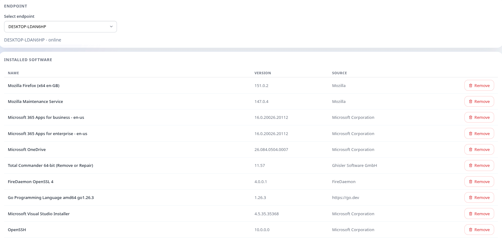
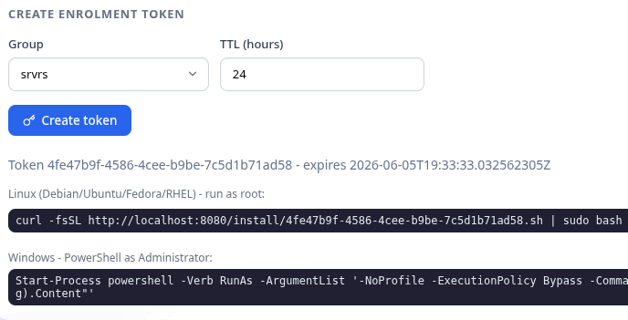
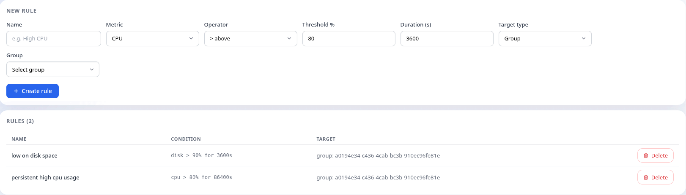
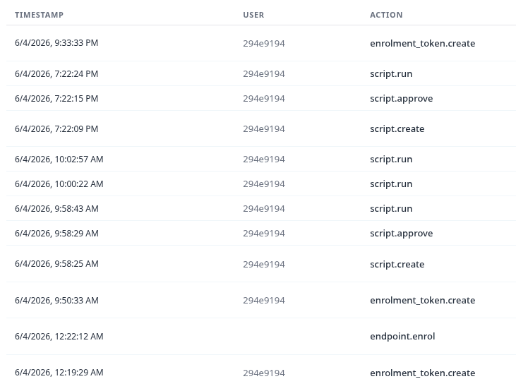

# Pulse RMM

Pulse RMM is a remote monitoring and management system for a fleet of Windows and Linux endpoints. You install a small Go agent on each machine, and from a browser you can watch what the machine is doing, open a shell or a full remote desktop on it, manage its installed software, run scripts across the whole fleet, and keep an immutable record of everything that happened.

The headline feature is remote access to the endpoint. The clip below is a user opening a remote desktop session, remote shell, and browsing files across the endpoint and viewing the running processes - all from the browser, with the agent doing the capture and input injection on the far side.


## What Pulse RMM does

Everything in Pulse RMM hangs off one idea: the agent dials out to the backend and holds a long-lived connection open, and every action a user takes in the browser travels down that connection as a command. Because the agent makes the outbound connection, it works through NAT and corporate firewalls without anyone opening a port. The same pattern carries metrics up, commands down, and acknowledgements back, so there is one mental model to learn rather than one per feature.


## Quick start

You need docker (or podman), `make`, and - only if you intend to rebuild the agent or webapp yourself - Go 1.22+, Java 21, and Node.js 18+.

```bash
# Copy the dev environment template and set a JWT secret inside it
cp deploy/.env.dev.example deploy/.env.dev

# Build images and start the whole stack (dependencies + backend + webapp)
make dev
```

`make dev` brings up PostgreSQL, Redis, RabbitMQ, MinIO, coturn, Keycloak, every backend service, and the webapp. Once it settles, the webapp is at `http://localhost:5173` and the API gateway is fronted by nginx at `http://localhost:8080`. Log in with the bootstrap admin credentials from your `deploy/.env.dev`. Use `make dev-logs service=api-gateway` to follow a single service and `make dev-down` to stop everything.

## Building

```bash
make dev-build                 # rebuild all backend + webapp container images
cd agent && make build         # cross-compile the Linux + Windows agent binaries
cd webapp && npm install && npm run build   # production webapp bundle
```

## Repository layout

```
pulse-rmm/
├── agent/                  # Go agent (Windows/Linux): metrics, shell, desktop, software, update
├── backend/                # Java 21 Spring Boot, Maven multi-module
│   ├── api-gateway/        # single REST/WebSocket entry point, auth, routing
│   ├── rbac-service/       # identity, JWT, users, roles, RBAC, Keycloak OIDC, multi-org
│   ├── endpoint-service/   # enrolment, groups, tags, agent-version distribution, sessions
│   ├── agent-hub/          # agent gRPC control plane, mTLS, shell/desktop bridges, dispatch
│   ├── ca-service/         # mTLS certificate authority (CSR signing, rotation, revocation)
│   ├── metric-service/     # telemetry + heartbeat ingestion into TimescaleDB
│   ├── alert-service/      # threshold rules, SSE notifications
│   ├── audit-service/      # immutable audit log, CSV/JSON export
│   ├── commands-service/   # script library, software inventory, process control
│   ├── integration-service/# outbound HMAC-signed webhooks
│   └── common/             # shared proto stubs, exceptions, utils
├── webapp/                 # React + Vite (Redux Toolkit, RTK Query)
├── proto/                  # protobuf contracts (gRPC), managed by buf
├── deploy/                 # compose files, env templates, k8s manifests, observability
├── e2e/                    # end-to-end tests (Python + pytest)
├── docs/                   # architecture and planning docs
└── Makefile                # dev, build, and test targets
```

## Tech stack

| Component | Technology |
|-----------|-----------|
| Agent | Go 1.22+, gRPC, gopsutil, Pion (WebRTC), ffmpeg |
| Backend | Java 21, Spring Boot 3, Maven, gRPC, Flyway |
| Webapp | React, Vite, Redux Toolkit, RTK Query, recharts |
| Database | PostgreSQL 16 + TimescaleDB extension |
| Cache | Redis 7 |
| Message broker | RabbitMQ 3 |
| Object storage | MinIO (S3-compatible) |
| Identity provider | Keycloak (OIDC) |
| Relay | coturn (STUN/TURN) |
| Observability | Prometheus, Grafana, Loki, Tempo |

## Remote access

Remote access is where the agent earns its keep. A user with the right permission opens a session on any online endpoint and the agent starts streaming the desktop over WebRTC, using the Pion library on the agent side and the browser's native WebRTC stack on the other. The screen is captured through ffmpeg - `gdigrab` on Windows, `x11grab` or a PipeWire portal on Linux - encoded as H.264, and pushed over a video track at thirty frames a second. Audio is captured alongside the video. Mouse and keyboard events travel back over a data channel and are injected into the operating system natively: `SendInput` on Windows, a `uinput` virtual device on Linux. When a direct peer-to-peer path is not available, the media is relayed through a coturn STUN/TURN server, so the session survives both sides being behind NAT. A separate data channel carries file uploads and downloads during the session, with path-traversal protection so a download cannot escape the user's home directory.

The same control connection also backs a remote shell. The agent spawns a real pseudo-terminal - bash through a PTY on Linux, cmd through ConPTY on Windows - and proxies its input and output over a WebSocket bridge to an `xterm.js` terminal in the browser. Several users can hold independent shell sessions on the same endpoint at once, and closing the tab tears the session down cleanly with no orphaned process. Whether a session is view-only or full control, and whether it can run unattended while no user is logged in, is decided by permissions on the server, never by the browser.

## Monitoring

Every agent collects CPU, memory, disk, and uptime roughly every thirty seconds and pushes the batch to the backend, which stores it in a TimescaleDB hypertable. The webapp shows the live numbers as charts and lets you scroll back through the retained history. Alongside the metric push the agent sends a heartbeat; if the backend stops hearing from an endpoint for about ninety seconds a scheduled job marks it offline, so the endpoint list reflects reality without anyone refreshing it. A technician with the right permission can also list the processes running on an endpoint and kill a runaway one without leaving the browser.

## Software and scripting

The agent scans installed software using whatever the platform provides - the Windows registry, and `dpkg`, `dnf`, or `flatpak` on Linux - and reports the inventory so you can answer "what is installed where" across the fleet. From the webapp you can install, update, or remove a package, and the request is delivered to the agent as a command, executed against the native package manager, and acknowledged with its output so the result shows up within seconds.

Scripting works the same way but is built around change control. Scripts live in a library; a technician with approval rights reviews them before they can be run by people who only hold the "run approved scripts" permission, while a separate ad-hoc permission allows uploading and running one-off scripts. A run can fan out to many endpoints at once, and each endpoint reports its own exit code and output. Secrets needed by a script are encrypted at rest and only decrypted in the agent process, so they never appear in the audit trail or the logs.



## Enrolment and the agent

An endpoint joins the fleet by enrolling. A technician generates an invitation token scoped to a group, and the agent presents that token on first run together with the public half of an ed25519 keypair it generates locally. The backend validates the token, records the public key, and issues the endpoint a stable UUID that survives reboots, OS upgrades, and hostname changes. From then on that UUID is the endpoint's identity everywhere in the system. Enrolling a second time from the same machine is idempotent - it does not create a duplicate.



The agent itself is a single Go binary with no runtime dependencies on the endpoint. It is packaged as a `.deb`, an `.rpm`, and a Windows installer, and there is a one-liner install script for onboarding over SSH or PowerShell. Once installed it registers as a system service - systemd on Linux, the Windows service manager on Windows - and starts on boot. Building and packaging the agent is documented in `agent/README.md`.

## Alerting

Alert rules are thresholds on a metric - say, disk above ninety percent - scoped to a group or a tag selector and required to hold for a configurable duration so a brief spike does not page anyone. An evaluator runs every thirty seconds against the metric history, and when a rule trips the backend pushes a notification to the browser over a Server-Sent Events stream, so the bell in the webapp lights up within seconds. Alerts are acknowledged with one click and will not re-fire until the condition clears and trips again.



## Audit

Every mutating action is recorded in an append-only audit log: who did it, what they did, when, on which endpoint, and which permission authorised it. The log has no update or delete path, so it cannot be rewritten from inside the application. Records are produced by publishing a domain event to RabbitMQ and persisted by a dedicated audit service, which keeps a slow audit write from blocking the API response. The log can be browsed with filters in the webapp and exported as CSV or JSON; the export streams its rows so it stays memory-efficient even over a large date range.



## Identity, access control, and multi-tenancy

Pulse RMM uses a permission-based access model. Every capability maps to a named permission, a role is just a bundle of permissions, and any permission can be scoped to the whole fleet or narrowed to specific endpoint groups. The system ships with four default roles - admin, senior technician, junior technician, and auditor - and lets you clone them or build custom roles from the catalogue. You can also grant a single permission directly to a user, scoped to a group and time-bounded, for situations like temporary incident access. Every API call and every gRPC command re-checks permissions on the server; the webapp hides controls a user cannot use, but that is a convenience, not the enforcement boundary.

User identity, passwords, and single sign-on are delegated to Keycloak over OIDC, which also handles multi-factor authentication at the identity-provider level, so disabling a user in the IdP cuts off their access. A single Pulse deployment can be divided into multiple organizations with isolated endpoints, users, and permissions, which is what makes it usable by a managed service provider running one instance for several customers.

## Agent auto-update

Agents update themselves, carefully. A new version is published as an artifact, and the rollout proceeds as a canary - one percent of the fleet first, then ten, then a hundred, with an admin advancing each stage. An agent downloads the new binary, verifies its SHA-256, keeps the old binary as a backup, and swaps atomically. After the swap it runs a health check, and if the new binary cannot start and reach the backend within a timeout it rolls back to the previous version on its own. The cohort for a given percentage is chosen deterministically from a hash of the endpoint UUID, so re-checking is idempotent and needs no extra state.

## Security

Agents and backend services authenticate each other with mutual TLS. A dedicated certificate authority service signs the agent's certificate during enrolment from a certificate-signing request, rotates it before expiry, and can revoke it, and the control-plane gRPC server checks the presented certificate against the revocation list on every connection. The agent's ed25519 enrolment key is generated on the endpoint and never leaves it. Secrets bound for scripts are sealed and only opened in the agent process.

Outbound integrations are available too: the integration service can post signed (HMAC-SHA256) webhooks to external systems on events like an alert firing, with retries and a dead-letter queue for deliveries that keep failing.

## Architecture

A browser talks to a single API gateway over REST and WebSocket. The gateway authenticates the request and forwards it to one of the backend services. Agents do not talk to the gateway for their long-lived connection - they hold a bidirectional gRPC stream to a dedicated control-plane service called the agent hub, which is where commands are dispatched to them and where shell and desktop signaling is bridged. Metrics land in TimescaleDB, hot state and the agent-to-pod connection registry live in Redis, domain events fan out over RabbitMQ, and agent installers and update artifacts sit in MinIO. The full picture, including the certificate authority and the WebRTC signaling path, is in [docs/architecture.md](docs/architecture.md).

## Testing

Backend tests run through the Makefile, which wires up `JAVA_HOME`, points Testcontainers at the rootless podman socket, and configures surefire/failsafe correctly - running raw `mvn` will not get those right.

```bash
make tests                                  # unit + integration, all modules
make tests-unit                             # unit only (skips integration tests)
make tests-it                               # integration only (Testcontainers)
make tests-it service=endpoint-service      # scope to one module
make e2e                                    # full end-to-end stack + Python suite
```

The agent and webapp use their native tooling - `cd agent && go test ./...` and `cd webapp && npm run test -- --run`. The full testing guide, including the one-time podman socket setup, is in [docs/testing.md](docs/testing.md).

## Documentation

- [docs/architecture.md](docs/architecture.md) - system design, the control plane, the WebRTC path, data flows
- [docs/agent.md](docs/agent.md) - the agent in depth: startup, control stream, remote desktop, auto-update
- [docs/user-stories.md](docs/user-stories.md) - permissions catalogue, roles, features by epic
- [docs/testing.md](docs/testing.md) - unit, integration, and end-to-end testing
- [agent/README.md](agent/README.md) - agent directory layout, building, and packaging
- [backend/README.md](backend/README.md) - index of the backend services

## License

Pulse RMM is released under the [MIT License](LICENSE).
