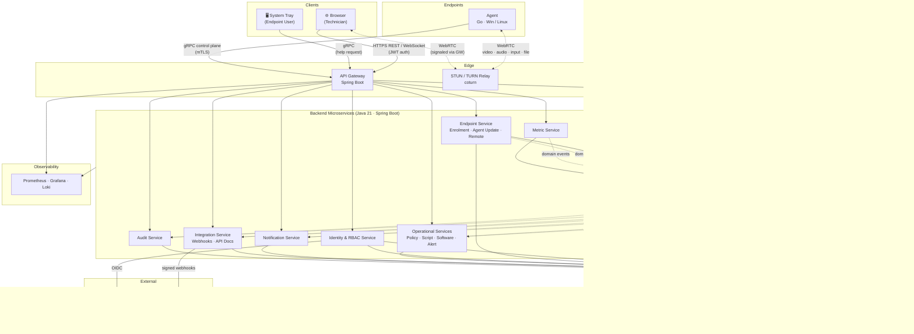
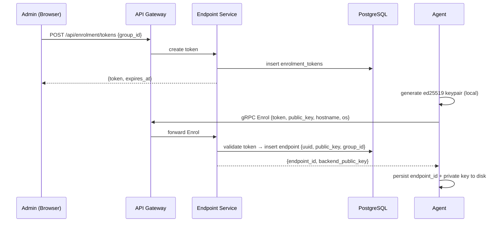
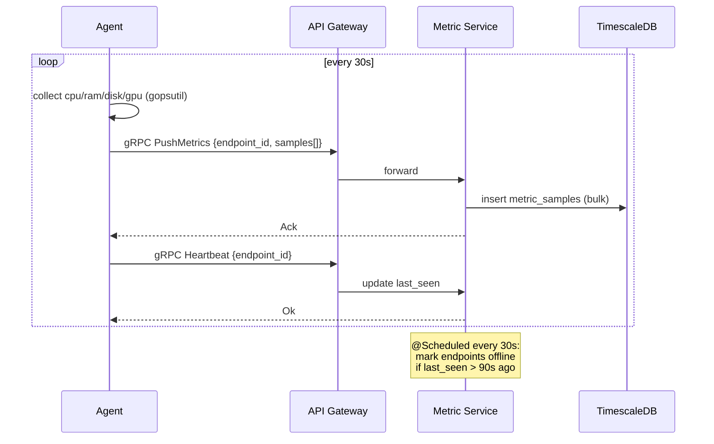
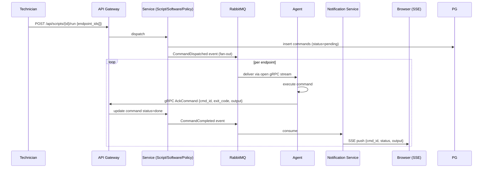
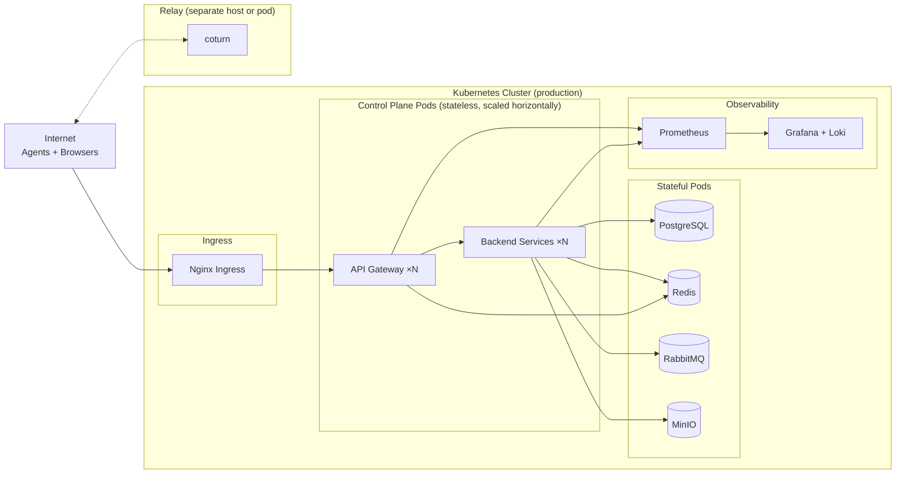

# Pulse RMM - Architecture

## system overview

pulse-rmm is split into four physical tiers: **endpoints** (agents), an **edge layer** (api gateway + turn relay), a set of **backend microservices**, and **data stores**. technicians access the system through a browser; endpoint users interact through a system tray application embedded in the agent.

---

## component diagram



---

## components

### agent
runs on every managed endpoint. communicates with the backend exclusively via grpc over the control-plane channel. responsible for:
- self-enrolment and keypair lifecycle
- metric collection and batched push
- executing commands (scripts, software installs, policy reconciliation)
- capturing and streaming the desktop over webrtc
- system tray ui (gui sessions only)

### api gateway
the single entry point for all external traffic. routes:
- `REST /api/**` from the browser to the appropriate backend service
- `grpc` streams from agents to endpoint-service and metric-service
- `WebSocket` from the browser for shell proxying and webrtc signaling

handles jwt validation and calls the identity service to evaluate permissions before forwarding. does not contain business logic.

### endpoint service
owns the entire endpoint aggregate: invitation tokens and the enrolment handshake (grpc `Enrol` rpc), the endpoint registry, agent version management and binary distribution, and remote desktop session lifecycle. these three domains share the endpoint as their aggregate root and run in a single spring boot process on port 8081.

### metric service
receives `PushMetrics` and `Heartbeat` grpc calls. writes to timescaledb. marks endpoints offline via a scheduled job when `last_seen` is stale (>90s). serves the historical metrics rest api.

### identity & rbac service
owns users, roles, permissions, group scopes, direct grants, and organizations. evaluates permission checks on behalf of the gateway. caches evaluated sets in redis (60s ttl). delegates user authentication to keycloak (oidc) or handles local login.

**keycloak integration:**
- keycloak is the source of truth for user identity (username, password, mfa, sso)
- rbac-service maintains roles and permissions as a separate concern from keycloak
- at login: webapp exchanges username/password for a keycloak token → rbac-service validates token and issues jwt
- organization membership: stored as a custom attribute on keycloak users; rbac-service reads org_id from token claims
- permission evaluation: for a given user + organization + endpoint_group, union of role-granted + directly-granted permissions, filtered by org scope
- multi-org support: users belong to one or more organizations; permissions are scoped per org (a user in org A cannot access org B's endpoints even if they have the same role)
- permission cache: evaluated permission sets cached in redis (key: user_id:org_id, ttl 60s) to avoid db hit on every request

### operational services
a logical grouping of four services that share the **command delivery pattern**:
- **policy service** - yaml policy authoring, drift detection, reconciliation
- **script service** - script library, approval workflow, bulk execution
- **software service** - installed-software inventory, install/update/remove commands
- **alert service** - threshold rule evaluation against timescaledb, alert lifecycle

### audit service
consumes every domain event from rabbitmq and appends an immutable record to postgres. no update or delete path exists. serves the paginated audit log and streaming csv export.

### integration service
manages outbound webhook registrations and delivery. consumes events, posts to registered urls with hmac-sha256 signatures. uses resilience4j for retries; failed deliveries move to a dead-letter queue.


### notification service
delivers real-time in-app events to connected browsers via server-sent events (sse). consumes alert events, help-request events, and command-ack events from rabbitmq.

---

## transport split

| channel | protocol | direction | used for |
|---------|----------|-----------|----------|
| control plane | grpc (mtls) | agent ↔ backend | enrolment · metrics · heartbeat · command delivery · webrtc signaling |
| remote session | webrtc | agent ↔ browser (via turn) | video · audio · keyboard/mouse input · file transfer |
| webapp api | https rest | browser → backend | all ui operations |
| webapp realtime | websocket | browser ↔ backend | terminal proxy · sse fallback |
| internal events | rabbitmq amqp | service → service | audit · notifications · webhooks · bulk fan-out |

---

## data ownership

| store | owned by | contains |
|-------|----------|----------|
| postgresql | all services (separate schemas) | users · roles · endpoints · policies · scripts · commands · alert rules · webhooks · audit events |
| timescaledb | metric service | metric_samples hypertable; compressed after 7d; pruned after 30d |
| redis | api gateway · identity service | evaluated permission sets (60s ttl) · agent connection registry (endpoint_id → pod) · active session tokens |
| rabbitmq | all services | domain events fanout; webhook dead-letter queue |
| minio / s3 | enrolment service · agent update service | signed agent installers (.exe, .deb, .rpm) · versioned update artifacts |

---

## key flows

### enrolment



### metric push & heartbeat



### remote desktop session setup

```mermaid
sequenceDiagram
    participant BR as Browser
    participant GW as API Gateway
    participant AG as Agent
    participant RLY as TURN Relay

    BR->>GW: POST /api/sessions {endpoint_id, type=desktop}
    GW->>GW: check remote:desktop:control permission
    GW->>AG: gRPC StartSession {session_id, type=desktop}
    AG-->>GW: SessionReady

    BR->>GW: WebSocket connect (signaling)
    BR->>GW: SDP offer
    GW->>AG: gRPC Signal {sdp_offer}
    AG->>AG: probe available encoders
    AG-->>GW: SDP answer (codec preference: av1/h264/vp9)
    GW-->>BR: SDP answer

    loop ICE negotiation
        BR->>GW: ICE candidate
        GW->>AG: gRPC Signal {ice_candidate}
        AG-->>GW: ICE candidate
        GW-->>BR: ICE candidate
    end

    AG<-->>RLY: TURN allocation (if p2p fails)
    BR<-->>RLY: TURN relay
    Note over BR,RLY: WebRTC stream established<br/>video · audio · input · file data channels
```

### command delivery (script / software / policy reconcile)



---

## deployment topology



agent grpc streams are kept pinned to the same gateway pod for their lifetime via lb sticky sessions (consistent hash on endpoint_id). all other traffic is round-robin stateless.

---

## local development networking (compose.yaml)

```
host network (5173, 8080, 9090)
    ↓
podman network (pulse-rmm)
    ├── api-gateway:8080           (REST API, gRPC proxy)
    ├── rbac-service:8081          (Identity & RBAC)
    ├── endpoint-service:8082      (Enrolment, agent updates)
    ├── metric-service:8083        (Metrics ingestion)
    ├── alert-service:8084         (Threshold rules, SSE)
    ├── audit-service:8085         (Immutable log)
    ├── integration-service:8086   (Webhooks)
    ├── commands-service:8087      (Scripts, software, processes)
    ├── postgres:5432              (Primary database)
    ├── redis:6379                 (Cache, session state)
    ├── rabbitmq:5672              (Message broker)
    ├── minio:9000                 (S3-compatible object storage)
    ├── coturn:3478                (STUN/TURN relay)
    └── keycloak:8080              (Identity provider, OAuth2)

webapp (Node.js dev server) runs on host at 5173
    → proxies /api requests to http://api-gateway:8080 (docker network)
    → proxies /oauth to http://keycloak:8080 (docker network)
```

**Service discovery in compose:**
- services communicate by container name (dns resolves within the podman network)
- e.g., api-gateway connects to postgres as `jdbc:postgresql://postgres:5432/pulse`
- external clients (browser, agent) connect to `localhost:8080` on the host

**Ports exposed to host:**
- `5173` - React dev server (webapp)
- `8080` - API gateway (REST + gRPC)
- `9090` - Keycloak (OAuth callback)
- all others (`5432`, `6379`, `5672`, `9000`) are internal to the podman network

**Volume mounts:**
- postgres data: named volume `postgres_data` (persists across restarts)
- redis, rabbitmq, minio: named volumes (same)
- code: bind-mounted from host (live reload for backend spring-boot-devtools, webapp HMR)

---

## design decisions

| decision | choice | reason |
|----------|--------|--------|
| agent-backend transport | grpc | bidirectional streaming, efficient binary encoding, strong contracts via proto |
| remote session transport | webrtc | low-latency p2p media; browser-native; data channels for file + input |
| metric storage | timescaledb (postgres extension) | reuses existing postgres; hypertable compression; no separate infra to operate |
| inter-service messaging | rabbitmq | simpler than kafka for this scale; adequate for fan-out, dead-letter, and retries |
| agent language | go | single static binary; cross-platform; goroutines for concurrency; no runtime dependency on endpoint |
| backend language | java 21 + virtual threads | familiar spring ecosystem; virtual threads eliminate the need for reactive programming while maintaining throughput |
| permission evaluation cache | redis 60s ttl | avoids db hit on every request; short ttl means revoked access takes effect quickly |
| canary cohort targeting | `hash(endpoint_id) mod 100` | deterministic - re-checking is idempotent; no extra state needed |
| windows software management | chocolatey | available on windows 10+; winget not available on all supported versions |
| linux screen capture (wayland) | pipewire portal | only standards-compliant option on wayland; requires user consent per session - unattended access not supported on wayland |
