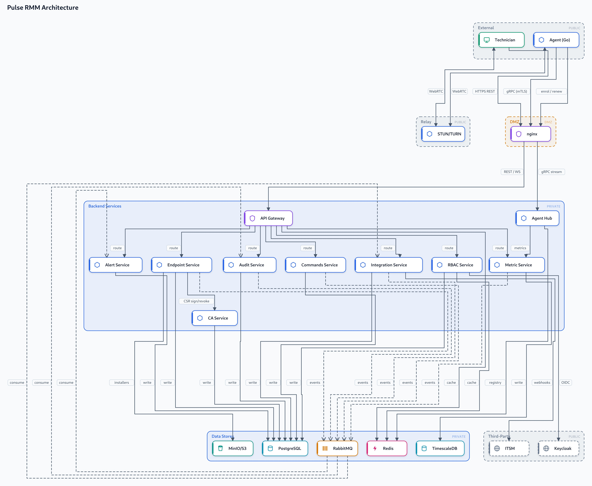
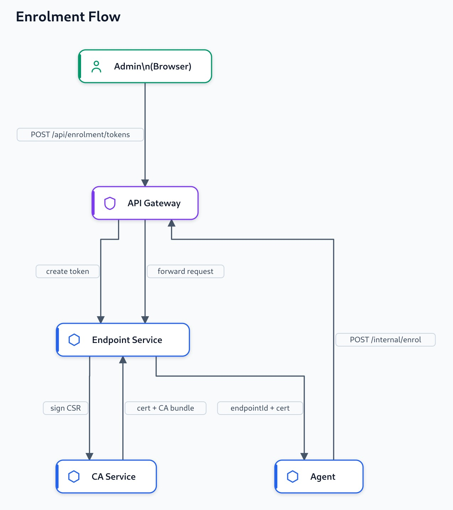
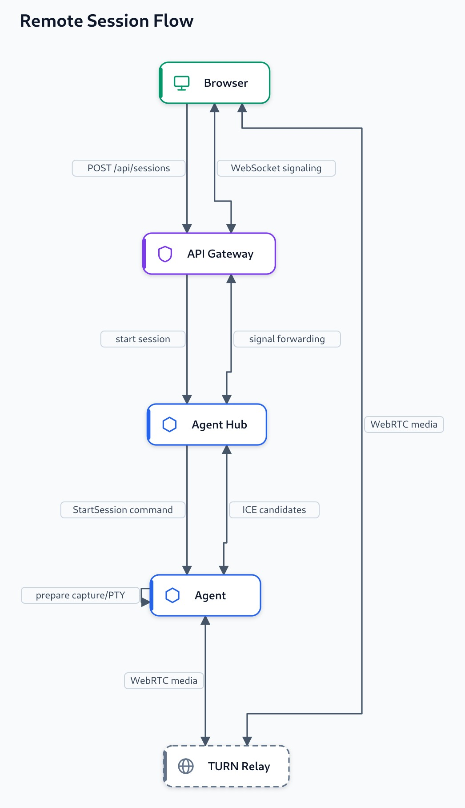
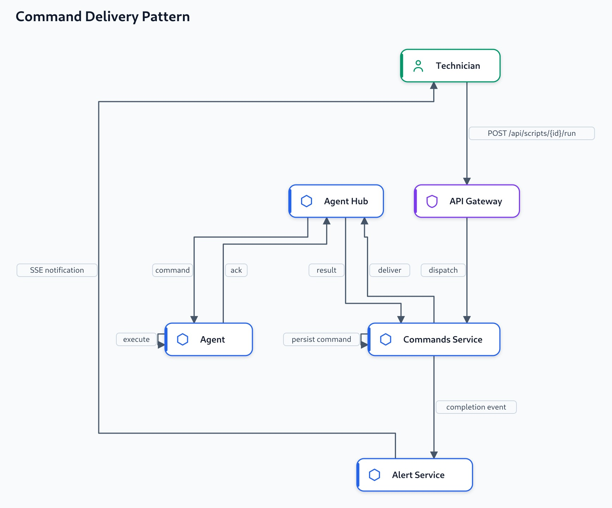

# Architecture

Three parts: a Go agent running on endpoints, Java backend services, and a React browser. The problem: agents sit behind NAT and firewalls, so they can't listen for incoming connections. Everything has to work with the agent dialing out to the backend and staying connected.

## Overview

Agents run as system services on Windows and Linux endpoints. Each agent is a single Go binary with no runtime dependencies. Technicians access the system through a React webapp running in their browser.

Nginx acts as a reverse proxy and load balancer, the only component reachable from the public internet. It accepts HTTPS REST traffic from browsers and gRPC traffic (over mTLS) from agents. All other components are internal only.

The API Gateway is a Spring Boot service that handles all REST traffic from the browser. It validates JWT tokens, checks permissions, and routes requests to the appropriate backend service. The Agent Hub is a dedicated service that holds the long-lived gRPC streams connecting all agents to the backend. When an agent connects, the hub registers it and uses it as a channel for command dispatch, shell/desktop signaling, and metric ingestion.

**Backend services.** Nine microservices handle specific domains:
- **Endpoint Service** - Agent enrollment, group management, agent version distribution, remote session coordination
- **CA Service** - Issues, rotates, and revokes agent mTLS certificates
- **RBAC Service** - User management, JWT generation, role-based access control, multi-organization scoping, Keycloak OIDC integration
- **Metric Service** - Ingests hardware telemetry and stores it in TimescaleDB
- **Commands Service** - Script library, software inventory, process control, command execution tracking
- **Alert Service** - Alert rules, threshold evaluation, real-time notifications to browsers over SSE
- **Audit Service** - Immutable log of all user actions, compliance, CSV/JSON export
- **Integration Service** - Outbound webhooks to external systems with HMAC signing and retries
- **Common** - Shared protobuf definitions, exceptions, and utility functions

Each service owns its schema in PostgreSQL. TimescaleDB stores time-series metrics. Redis caches evaluated permissions and tracks which hub instance owns each agent. RabbitMQ fans out domain events (enrollment, script completion, alerts fired) to interested services. MinIO stores agent installer binaries and versioned updates.

Keycloak handles user authentication via OIDC. STUN/TURN relay (coturn) enables WebRTC media when agents and browsers can't reach each other directly. External systems can receive webhooks from the integration service.

Browser requests go to nginx over HTTPS, forwarded to API Gateway. Agents connect outbound to nginx over mTLS gRPC to the agent-hub, holding a persistent stream for command delivery and metrics. WebRTC media for remote desktop/shell uses the coturn relay when needed. Internal services communicate via REST, gRPC, and RabbitMQ events.

## The agent

The agent is a single Go binary that runs as a system service. On startup it reads the config, loads the endpoint UUID and keypair from disk, and if those don't exist yet, it enrolls. Then it spawns a few goroutines that tick on timers to do background work - sending heartbeats, collecting metrics, scanning installed software. The main goroutine blocks on the control stream connection to the backend.

The control stream is bidirectional gRPC. One goroutine reads incoming commands off the stream and pushes them to a channel. The main loop reads from an outbox channel and sends back results. When a command arrives, a dispatcher looks at the protobuf type and routes it to the right handler - scripts, software, processes, shell, desktop. Every feature reuses this same pattern. See [agent.md](agent.md) for details.

## Enrolment and identity

An admin creates an enrolment token scoped to a group and generates a one-liner install script. When that script runs on a machine, the agent reads the token and backend URL from it, generates an ed25519 keypair locally, builds a CSR, and POSTs to `/internal/enrol` with the token and public key.

The endpoint-service validates the token (not used, not expired, correct group), passes the CSR to ca-service which signs it, then sends back the cert plus a UUID. The agent saves three things: endpoint UUID, private key, and the signed cert.

The UUID is permanent - it survives reboots, OS reinstalls, hostname changes. It's the endpoint's identity everywhere. By leaving enrolment with a valid mTLS cert, the agent can connect to the hub right away without a separate bootstrap dance. Enrolment is idempotent on the public key - if you re-enroll from the same machine you get the same UUID back. Cert renewal is the same flow - post to `/internal/cert/renew` and ca-service signs a new one.

## The control plane: agent hub

The agent-hub is where all the agent streams live. Thousands of them. When an agent connects, the hub checks the mTLS cert, stores the stream in memory in an AgentRegistry, and tells Redis "agent X is connected to hub instance Y". Other services look up the agent in Redis to find which hub instance owns it.

The hub also acts as a protocol bridge. Browsers send WebSocket messages, agents speak gRPC. The hub translates between them. A remote shell command from the browser comes in as WebSocket, the hub forwards it as a gRPC message to the agent, the agent executes it, sends back a result, and the hub converts it back to WebSocket to send to the browser.

Metric batches from agents get forwarded to metric-service. Commands from commands-service and alert-service hit internal hub endpoints that push the command onto the right agent's stream. The hub is basically the central nexus - everything goes through it.

## Remote sessions

Browser calls endpoint-service to start a session. The service checks permissions, makes sure the endpoint is online, saves the session record, and tells the hub to send a StartSession command to the agent. The agent then prepares - desktop mode starts screen capture and opens video/audio streams, shell mode spawns a PTY. Once ready, the agent reports back and the browser opens a WebSocket for WebRTC signaling. Agent and browser negotiate a WebRTC connection.

The agent runs ffmpeg to capture the screen - gdigrab on Windows, x11grab or PipeWire on Linux. It encodes as H.264 and sends frames to the WebRTC video track at 30fps. Audio is captured and sent too. Mouse and keyboard input comes back over a WebRTC data channel and gets injected with SendInput (Windows) or uinput (Linux). Input is rate-limited to avoid CPU spikes. File transfers use their own data channel so a big file doesn't stall keyboard input. Home directory files can be downloaded; path traversal is blocked. WebRTC uses Trickle ICE - both sides start sending candidates as soon as they're gathered instead of waiting for everything first. If the agents and browser can't connect peer-to-peer, coturn relays the media.

Simpler than desktop. No screen capture. Spawn bash on Linux or PowerShell/cmd on Windows in a PTY/ConPTY. The hub proxies bytes back and forth between the agent stream and the browser WebSocket. Multiple shells can run on the same endpoint at the same time. When you close the session, the agent makes sure not to resurrect it if a late message arrives.

On Wayland, the screen capture portal asks the user for permission every time. That means unattended desktop access doesn't work - if the user isn't logged in or denies it, you get an error.

## The command-delivery pattern

Scripts, software installs, process kills - they all follow the same pattern. Insert, deliver, acknowledge.

User runs a script from the webapp. The request hits commands-service which saves it as `status=pending`, tells the hub to deliver it, and the hub pushes it onto the agent's stream. Agent runs it and sends back the exit code and output. Hub forwards the result back to commands-service, which updates the command to `status=done` and posts a completion event to RabbitMQ. Alert-service consumes that and pushes the output to the browser over Server-Sent Events. Live output appears.

Bulk operations just repeat this for each endpoint. One API call becomes N pending commands.

Secrets in scripts are encrypted at rest and only decrypted when the command is being built on the agent. They never show up in logs or the audit trail.

## Metrics and telemetry

Every 30 seconds the agent collects CPU, memory, disk, and uptime using gopsutil and pushes the batch to the backend over the control stream. The hub forwards it to metric-service which writes to a TimescaleDB hypertable.

The agent also sends a lightweight heartbeat that updates endpoints.last_seen. Metric-service has a background job that marks endpoints offline if last_seen hasn't been updated in 90 seconds. The endpoint list automatically reflects who's online without needing a manual refresh.

When you want to look at historical data, metric-service queries the hypertable by endpoint, time range, and metric type and the webapp draws charts from that. We use TimescaleDB (a PostgreSQL extension) instead of a separate time-series database because it's one less system to run and the hypertable handles compression and expiration on its own.

## Mutual TLS and the certificate authority

Ca-service is small but important. It holds the encrypted root key, signs CSRs during enrolment and renewal, and maintains the revocation list.

Agent-hub's gRPC server validates every incoming agent connection by checking the client cert and checking it against the revocation list. If the cert is revoked, the connection is killed. If it's valid, the stream is accepted. Revoking an endpoint cuts off both future cert issuance and current connections - no need to SSH in and kill the binary, just revoke it and it drops offline.

## Eventing and audit

Every mutation - create endpoint, run script, kill process produces a domain event. Services post events to RabbitMQ. Audit-service consumes them and appends a row to Postgres - who did it, what, when, which endpoint, which permission. Write-only.

Using RabbitMQ decouples audit from the API response path, so a slow disk write on the audit service doesn't slow down the API. The same events go to integration-service and alert-service. Integration posts HMAC-signed webhooks to external systems with retries and a dead-letter queue. Alert-service pushes notifications to browser tabs over Server-Sent Events.

Audit records export as CSV or JSON streamed row by row so they stay memory-efficient even over long date ranges.

## Transport split

The system deliberately uses different transports for different jobs, summarised here because the distinction is easy to lose.

| Channel | Protocol | Direction | Carries |
|---------|----------|-----------|---------|
| Control plane | gRPC (mTLS) | agent ↔ agent hub | commands, acks, metric batches, session signaling |
| Enrolment & cert | HTTPS (internal) | agent → endpoint service | enrol, heartbeat, certificate renewal |
| Remote session | WebRTC | agent ↔ browser (via relay) | video, audio, input, file transfer |
| Webapp API | HTTPS REST | browser → gateway | all UI operations |
| Webapp realtime | WebSocket / SSE | browser ↔ backend | shell + desktop signaling, notifications |
| Internal events | AMQP | service → service | audit, webhooks, alert fan-out |

## Data ownership

Each data store has a single owner service, which keeps services from tangling up with each other.

| Store | Owner | Holds |
|-------|-------|-------|
| PostgreSQL | every service (separate schemas) | users, roles, endpoints, groups, tokens, scripts, commands, alert rules, webhooks, audit events, CA records |
| TimescaleDB | metric service | metric samples hypertable, compressed and then pruned as it ages |
| Redis | gateway, RBAC service, agent hub | evaluated permission sets (short TTL), the endpoint-to-hub connection registry, session state |
| RabbitMQ | every service | domain-event fan-out and the webhook dead-letter queue |
| MinIO / S3 | endpoint service | agent installers and versioned update artifacts |

## Design decisions

Why we made certain choices.

| Decision | Choice | Why |
|----------|--------|-----|
| Agent ↔ backend transport | gRPC bidirectional stream | one outbound connection per agent carries everything; works through NAT/firewalls; strong proto contracts |
| Remote session transport | WebRTC | low-latency, browser-native media; data channels for input and files; NAT traversal via TURN |
| Holding agent connections | dedicated agent hub service | one place owns the streams and the routing; other services stay stateless |
| Metric storage | TimescaleDB extension | reuses Postgres; hypertable compression and retention; no separate datastore to run |
| Inter-service messaging | RabbitMQ | simpler than Kafka at this scale; good enough for fan-out, retries, and dead-letter |
| Agent language | Go | a single static binary with no endpoint runtime dependency; goroutines for concurrency |
| Backend language | Java 21 + virtual threads | familiar Spring ecosystem; virtual threads give throughput without a reactive rewrite |
| Agent identity | per-agent mTLS cert via internal CA | identity is not a shared secret; revocation cuts off a single endpoint |
| Permission cache | Redis with a short TTL | avoids a DB hit per request while keeping revocation reasonably prompt |
| Windows screen capture (Wayland analogue) | PipeWire portal on Linux Wayland | the only standards-compliant option; its per-session consent is why unattended Wayland access is unsupported |
